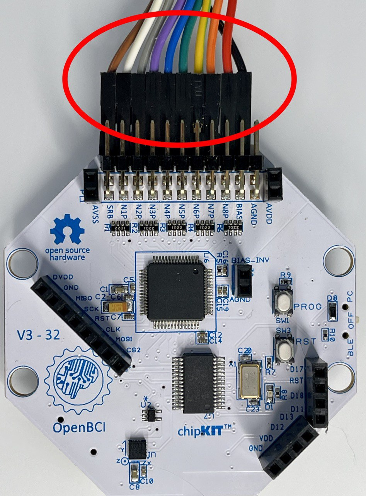
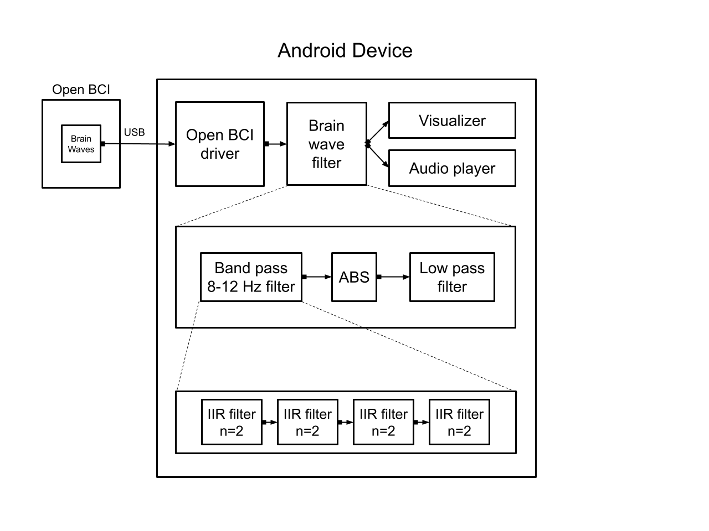

# *NeuroFit*  for Open BCI

## The motivation behind creating NeuroFit
Your brain produces 4 different types of waves and one of them is Alpha. These waves are often associated with meditation and deep states of calm. Increased Alpha waves are known to produce increased relaxation, resolution of long-entrenched trauma, and recovery from substance abuse (when coupled with professional psychotherapy). Training Alpha waves is a process that is as simple as meditating. To train alpha waves you'll need an EEG machine, which is available for masses and doesn't require a medical license. You simply connect the EEG electrodes to your head and meditate. When you see an Alpha waves burst, remember what you thought about what state your mind was in and do it again. At the moment this simple and noninvasive training is not widely available when it should be accessible from the comfort of every person's home. That's why I created NeuroFit.

## What's NeuroFit?
NeuroFit is a real-time brain wave visualizer and Alpha wave neurofeedback training app, that is designed to work with your **Android device** (phone, tablet, etc.). Simply download NeuroFit from Play Market and plug in your 8-channel Open BCI EEG machine to start. The app has 3 brain wave **real-time visualization modes*: 
1. All waves - displays all the brain waves in 
2. Alpha waves - displays Alpha waves, that were filtered from all waves
3. Alpha Envelope waves - displays only the Alpha wave amplitude

## How to use it?
NeuroFit serves as a data visualizer and as an Alpha waves trainer. To start a training session, I recommend following the steps below:
1. Connect electrodes in the following color order on the Open BCI board: 

2. Connect the Open BCI electrodes to your head based on 10-20 EEG electrode system:
 - O1 - red
 - O2 - orange
 - P3 - yellow
 - P4 - green
 - C3 - blue
 - C4 - purple
 - Fp1 - gray
 - Fp2 - white  

3. Hit the button "Start Real-time streaming".
4. During your setup use "All Waves" mode to make sure that all the Open BCI electrodes are well connected.
5. Use the calibration bar to zoom in or out of the visualization graphs.
6. When you are ready to start your training session, hit the button stat Audio feedback.
7. Close your eyes and meditate.
8. The app will produce calming music, if it's too loud adjust the volume on your device. The music will play louder when NeuroFit detects an Alpha wave burst. 
### Goal: Try to get the music volume louder with your mind.

## For Developers: How does it work?

The graph above describes the data flow of the application.
+ ***OpenBCI driver*** was created from scratch based on the [OpenBCI SDK](https://docs.openbci.com/Cyton/CytonSDK/).
+ ***Brainwave filter*** component implements Infinite Impulse Response filter with a second order filter to filter Alpha waves. Due to lack of libraries for signal processing on Andorid, I have implemented IIR and a second order filter in Kotlin from scratch.
+ ***Visualizer*** in a custom View component that uses Android Canvas API to display Brain Waves at 60 spf rate

## License
This project is licensed under the MIT License.